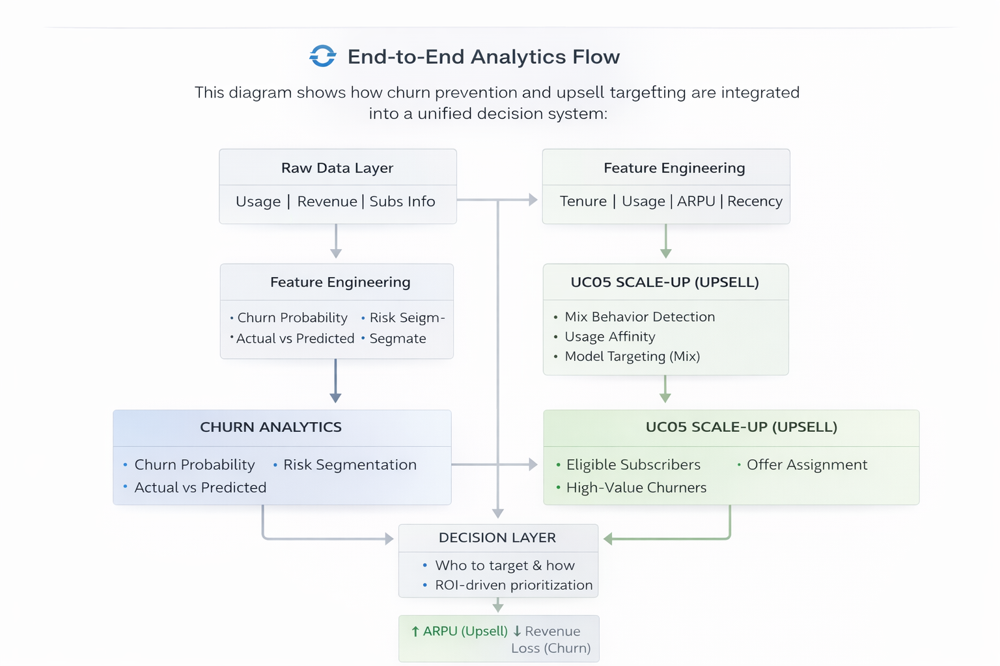

# Telecom Revenue Optimization

This project simulates a real telecom decision system — combining **revenue growth (upsell)** and **revenue protection (churn reduction)** into a unified analytics workflow.

It focuses not only on predicting churn, but on answering the key business question:

> Which customers should we target to maximize revenue impact and campaign ROI?

---

## 🧠 Problem Statement

Traditional churn models identify **who is likely to churn**, but fail to answer:

- Which customers actually matter financially?
- How much revenue is at risk?
- How should targeting be prioritized?
- How can we increase revenue, not just prevent loss?

This project bridges that gap by combining **churn risk + customer value + upsell opportunities**.

---

## 🏗 System Perspective

This project represents a **decision system**, composed of:

- **Data Layer** — raw usage, revenue, subscriber data  
- **Feature Layer** — behavioral and financial signals  
- **Model Layer** — churn & upsell targeting models  
- **Decision Layer** — ROI-driven targeting logic  
- **Execution Layer** — campaign targeting (simulated)  

👉 The goal is **optimal decision-making**, not just prediction.

---

## 🎯 Analytical Scope

This project covers two complementary telecom analytics domains:

- **Revenue Growth (Upsell)** — via Mix Users Upsell (behavioral targeting)  
- **Revenue Protection (Churn)** — via churn prediction and retention optimization  

---

## 🔄 End-to-End Analytics Flow

This diagram illustrates how upsell and churn flows are integrated into a unified system:

  

*Unified decision system combining churn prevention and upsell targeting*

---

## ⚙️ Solution Overview

| Layer | Description |
|------|------------|
| **Feature Engineering** | Behavioral + revenue features |
| **Churn Analytics** | Risk segmentation |
| **Upsell Targeting** | Mix behavior-based targeting |
| **Decision System** | ROI-based prioritization |

---

## ⚙️ Key Components

### 1. Feature Engineering
- Tenure segmentation (lifecycle modeling)
- Usage behavior (data vs voice mix)
- Revenue features (30/90-day rolling charges)
- Activity signals (recency & engagement)

---

### 2. Churn Analytics (Revenue Protection)
- Churn probability modeling
- Risk segmentation
- Actual vs predicted churn validation

---

### 3. Revenue Risk Estimation
- Calculates total revenue from churners (90-day window)
- Identifies high-value churn segments

---

### 4. Mix Users Upsell (Revenue Growth)
- Detects mix usage behavior (data + voice)
- Identifies upsell-ready users
- Applies model-driven targeting
- Assigns personalized offers

---

### 5. Decision Layer
- Combines churn + upsell insights
- Prioritizes users based on revenue impact
- Optimizes targeting strategy

---

## 📊 Key Results

- Top ~10% highest-risk users capture **~25–35% of total revenue at risk**  
- High-value churners drive the majority of financial impact  
- Targeted campaigns preserve **~70–80% of revenue while reducing campaign size**  
- Upsell targeting increases ARPU through mix package adoption  

---

## ⚖️ Trade-offs & Assumptions

- Targeting fewer users increases ROI but reduces coverage  
- Revenue thresholds prioritize value over volume  
- Retention rates are simulated (no uplift modeling yet)  
- Model performance assumed stable across segments  

---

## 🧩 SQL Pipelines (Production Layer)

### 🔥 Mix Users Upsell Pipeline
A production-grade Oracle SQL pipeline for behavioral targeting:

- Filters eligible subscribers (90-day behavior)
- Applies revenue constraints
- Detects mix usage affinity
- Integrates model predictions
- Assigns personalized offers
- Maintains 30-day lifecycle

---

### Churn Analytics Pipelines
- `feature_engineering.sql` — builds model features  
- `revenue_at_risk.sql` — calculates revenue exposure  

📂 Full SQL documentation: [sql/README.md](sql/README.md)

---

## 📂 Project Structure
telecom-revenue-optimization/
│
├── sql/
│ ├── mix_users_upsell_pipeline.sql
│ ├── feature_engineering.sql
│ └── revenue_at_risk.sql
│
├── notebooks/
│ └── churn_analysis.ipynb
│
├── outputs/
│ └── charts/
│ ├── lift_curve.png
│ └── analytics_flow.png
│
└── README.md

---

## ⚙️ Tech Stack

- **Oracle SQL (PL/SQL)** — production pipelines  
- **Python (Pandas, NumPy)** — analysis & simulation  
- **Jupyter Notebook** — workflow  
- **Matplotlib** — visualization  

---

## 🔬 Technical Highlights

- Rolling window aggregations (30/60/90 days)  
- GTT-based pipeline optimization  
- MERGE + DELETE incremental refresh  
- Performance tuning (MATERIALIZE, USE_HASH)  

---

## 🚀 Production Considerations

- Designed for **daily batch execution**  
- Uses incremental updates (MERGE instead of full rebuild)  
- Pre-aggregated tables reduce compute cost  
- Scalable to millions of subscribers  

---

## 🧩 Challenges

- Aligning churn probability with revenue impact  
- Avoiding bias toward low-value churners  
- Balancing upsell vs retention strategies  
- Handling missing model predictions  

---

## 💼 Business Impact

- Identifies **high-value churners**  
- Quantifies **revenue at risk**  
- Enables **ROI-driven targeting**  
- Increases ARPU through upsell  
- Improves campaign efficiency  

👉 Key takeaway:  
Combining **upsell + churn analytics** maximizes total revenue impact.

---

## 🚀 Next Steps

- Add uplift modeling  
- Include campaign cost → ROI  
- Build BI dashboard  
- Deploy end-to-end pipeline  

---

## 👤 Author

**David Jokhadze**  
Data Analyst — Telecom & Revenue Analytics  

- SQL (Oracle, PL/SQL)  
- Python (analytics workflows)  
- Churn & upsell analytics  

---

## 📬 Contact

- GitHub: https://github.com/David-johanson  
- Telegram: https://t.me/JOHANSON_D  
