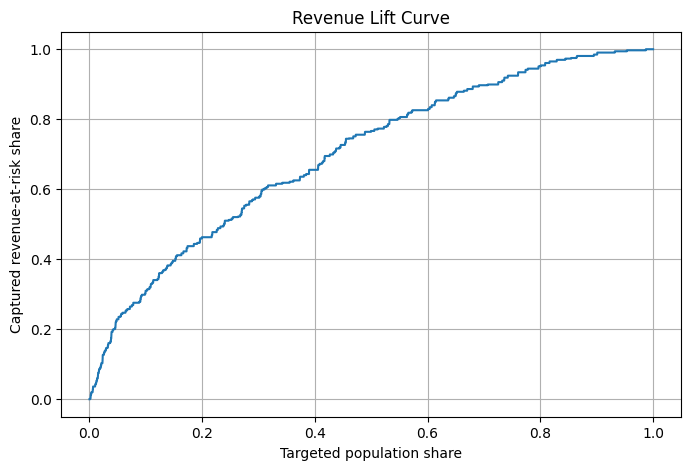

# Churn Revenue Optimization

This project simulates a real telecom retention workflow — from churn prediction to revenue-driven targeting and campaign value estimation.

It focuses not only on predicting churn, but on answering the key business question:

> Which customers should we target to maximize retention ROI?

---

## 🧠 Problem Statement

Traditional churn models identify **who is likely to churn**, but fail to answer:

- Which customers actually matter financially?
- How much revenue is at risk?
- What is the expected return of a retention campaign?

This project bridges that gap by combining **churn risk + customer value + targeting strategy**.

---

## 🏗 System Perspective

This project can be viewed as a decision system composed of:

- **Data Layer** — raw usage, revenue, and subscriber data  
- **Feature Layer** — behavioral and financial signals  
- **Model Layer** — churn probability estimation  
- **Decision Layer** — revenue-driven targeting logic  
- **Execution Layer** — campaign deployment (simulated)  

The goal is not only prediction, but **optimal decision-making under business constraints**.

---
## 🎯 Analytical Scope

This project covers two core telecom analytics domains:

- **Revenue Growth (Upsell)** — via mix package scale-up targeting (UC05)
- **Revenue Protection (Churn)** — via churn prediction and retention optimization
---  

## 🔄 End-to-End Analytics Flow
            ┌──────────────────────────────┐
            │        Raw Data Layer        │
            │------------------------------│
            │ Usage | Revenue | Subs Info  │
            └──────────────┬───────────────┘
                           │
                           ▼
            ┌──────────────────────────────┐
            │     Feature Engineering      │
            │------------------------------│
            │ Tenure | Usage | ARPU | Recency │
            └──────────────┬───────────────┘
                           │
            ┌──────────────┴──────────────┐
            ▼                             ▼
┌──────────────────────┐ ┌──────────────────────┐
│ CHURN ANALYTICS │ │ UC05 UPSCALE │
│----------------------│ │----------------------│
│ Churn Probability │ │ Mix Behavior │
│ Risk Segmentation │ │ Usage Affinity │
│ Actual vs Predicted │ │ Model Targeting │
└──────────┬───────────┘ └──────────┬───────────┘
│ │
▼ ▼
┌──────────────────────┐ ┌──────────────────────┐
│ REVENUE AT RISK │ │ TARGET BASE │
│----------------------│ │----------------------│
│ 90D Revenue Loss │ │ Eligible Users │
│ High-Value Users │ │ Offer Assignment │
└──────────┬───────────┘ └──────────┬───────────┘
└──────────────┬────────────────────────┘
▼
┌──────────────────────────────┐
│ DECISION LAYER │
│ Who to target & how │
│ ROI-driven prioritization │
└──────────────┬───────────────┘
▼
┌──────────────────────────────┐
│ BUSINESS IMPACT │
│ ↑ ARPU | ↓ Revenue Loss │
└──────────────────────────────┘

            
## 🎯 Solution Overview

| Layer | Description |
|------|------------|
| **Feature Engineering** | Behavioral + revenue features (usage, tenure, recency) |
| **Churn Analysis** | Risk segmentation using churn probabilities |
| **Value Optimization** | Revenue-at-risk calculation + targeting strategy |

---

## ⚙️ Key Components

### 1. Feature Engineering
- Tenure segmentation (lifecycle modeling)
- Usage behavior (data vs voice mix)
- Revenue features (30/90-day rolling charges)
- Activity signals (recency & engagement)

### 2. Churn Analysis
- Probability-based segmentation  
- Actual vs predicted churn validation  
- Portfolio-level churn KPIs  

### 3. Revenue at Risk
- Calculates total revenue from actual churners (90-day window)  
- Identifies financially impactful churn segments  

### 4. Targeting Strategy
Targets only **high-impact customers**:

- `churn_prob ≥ 0.60`  
- `total_charge_90d ≥ 20 GEL`  

👉 Avoids inefficient mass campaigns  

### 5. Value Estimation (VE)

| Retention Rate | Scenario |
|---------------|----------|
| 10% | Conservative |
| 20% | Realistic |
| 30% | Optimistic |

### 6. Revenue Lift Curve
- Measures how efficiently revenue is captured  
- Demonstrates prioritization of high-risk users  

---

## 📊 Key Results

- Top ~10% highest-risk users capture **~25–35% of total revenue at risk**  
- High-value churners (≥20 GEL) drive the majority of financial impact  
- Targeted campaigns preserve **~70–80% of revenue while reducing size**  
- Even **10–20% retention success** yields strong revenue recovery  

---

## ⚖️ Trade-offs & Assumptions

- Targeting fewer users increases ROI but reduces coverage  
- Revenue thresholds prioritize value over volume  
- Retention rates are simulated (no uplift modeling yet)  
- Model performance assumed stable across segments  

---

## 🧩 SQL Pipelines (Production Layer)

This project includes production-style Oracle SQL pipelines used in telecom environments.

### 🔥 UC05 Scale-up Pipeline (Upsell / Behavioral Targeting)

A production-grade pipeline designed for **mix package scale-up (upsell)** use case.

#### Objective:
Identify subscribers with high likelihood to **upgrade to higher-value mix packages** based on behavioral patterns.

#### Key Logic:
- Filters eligible subscribers using 90-day usage behavior  
- Applies revenue constraints (mix charge range)  
- Identifies users with strong **mix affinity (data + voice usage)**  
- Integrates ML model predictions (mix propensity)  
- Assigns personalized offer bundles (`Offer1–Offer4`)  
- Maintains a **30-day active targeting window**

#### Business Goal:
Increase ARPU by converting medium-value users into higher-value **mix package subscribers**

---

### Other SQL Modules (Churn-Oriented)

- `feature_engineering.sql` — builds churn model features  
- `revenue_at_risk.sql` — calculates churn-related revenue exposure  

📂 Full SQL documentation: [sql/README.md](sql/README.md)

---

## 📂 Project Structure
churn-revenue-optimization/
│
├── sql/
│ ├── uc05_scaleup_pipeline.sql
│ ├── feature_engineering.sql
│ └── revenue_at_risk.sql
│
├── notebooks/
│ └── churn_analysis.ipynb
│
├── data/
├── outputs/
│ └── charts/
│ └── lift_curve.png
│
└── README.md

---

## ⚙️ Tech Stack

- **Oracle SQL (PL/SQL)** — production pipelines  
- **Python (Pandas, NumPy)** — analysis & simulation  
- **Jupyter Notebook** — workflow  
- **Matplotlib** — visualization  

---

## 🔬 Technical Highlights

- Rolling window aggregations (30/60/90 days)  
- GTT-based pipeline optimization  
- MERGE + DELETE incremental refresh  
- Performance tuning (MATERIALIZE, USE_HASH)  

---

## 🚀 Production Considerations

- Designed for **daily batch execution**  
- Uses incremental updates (MERGE instead of full rebuild)  
- Pre-aggregated tables reduce compute cost  

---

## 🧩 Challenges

- Aligning churn probability with revenue impact  
- Avoiding bias toward low-value churners  
- Handling missing model predictions  
- Balancing campaign scale vs ROI  

---

## 💼 Business Impact

- Identifies **high-value churners**  
- Quantifies **revenue at risk**  
- Enables **ROI-driven targeting**  
- Reduces campaign cost while preserving value  

👉 Key takeaway:  
Focusing on high-value churners significantly improves campaign ROI.

---

## 🚀 Next Steps

- Add uplift modeling  
- Include campaign cost → ROI  
- Build Power BI dashboard  
- Deploy end-to-end pipeline  

---

## 👤 Author

**David Jokhadze**  
Data Analyst — Telecom & Revenue Analytics  

- SQL (Oracle, PL/SQL)  
- Python (analytics workflows)  
- Churn & retention analytics  

---

## 📈 Visualization

---

## 📬 Contact

- GitHub: https://github.com/David-johanson  
- Telegram: https://t.me/JOHANSON_D  
